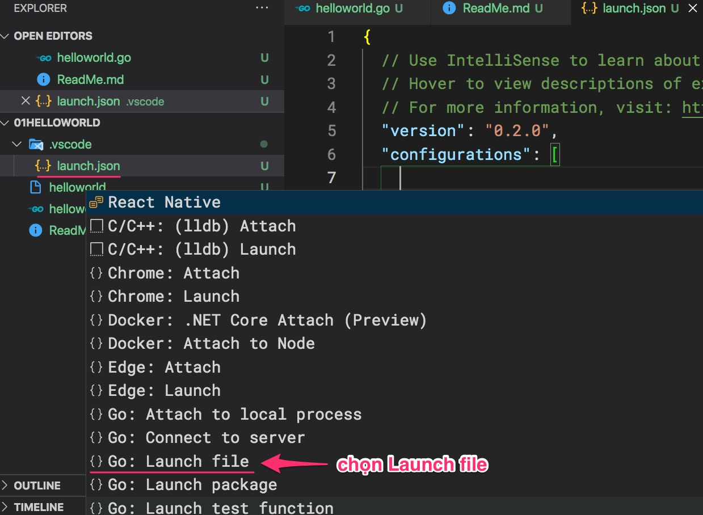

# Thực hành

## 1. Gõ lệnh ```go run```

Mở terminal/console rồi gõ
```
$ go run helloworld.go
hello world
```

## 2. Gõ lệnh ```go build```
```
$ go build helloworld.go
$ ls
ReadMe.md     helloworld    helloworld.go
$ ./helloworld
hello world
```

## 3. Sử dụng VSCode
Add configuration: Go: Launch file

Nội dung của file launch.json
```json
{
  "version": "0.2.0",
  "configurations": [
    {
      "name": "Launch file",
      "type": "go",
      "request": "launch",
      "mode": "debug",
      "program": "${file}"
    }
  ]
}
```

Thử đặt break point ở một dòng


Hãy thử sửa ```package main``` thành ```package app``` rồi chạy xem có được không?

## 4. Tạo thêm file [helloyou.go](helloyou.go)

```go
package main

import "fmt"

func Say(msg string) {   //Chữa hoa có nghĩa đây là hàm public
	fmt.Println(msg)
}
```

sửa file [helloworld.go](helloworld.go)
```go
func main() {
	fmt.Println("hello world")
	Say("Hello my friend")
}
```

rồi gõ lệnh
```
$ go run *.go
hello world
Hello my friend
```
hoặc
```
$ go run helloworld.go helloyou.go
hello world
Hello my friend
```


## Hỏi: 
1. ```go run``` khác gì với ```go build```?
2. go có cần môi trường JDK với Java hay .NET run time với C# không?
3. Ý nghĩa của ```package main```
  tự đọc bài này nhé [Understanding Golang Packages](https://thenewstack.io/understanding-golang-packages/)


