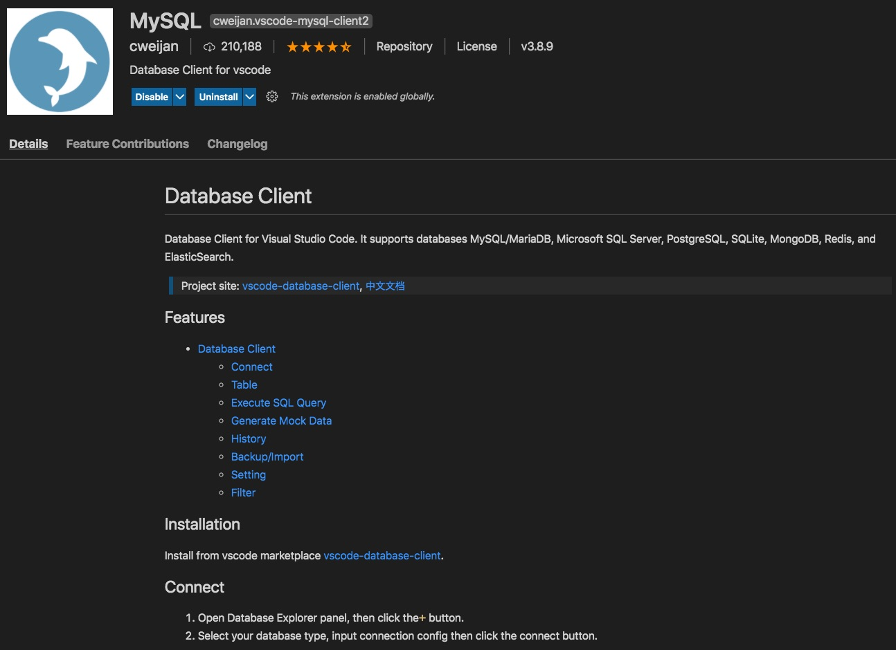
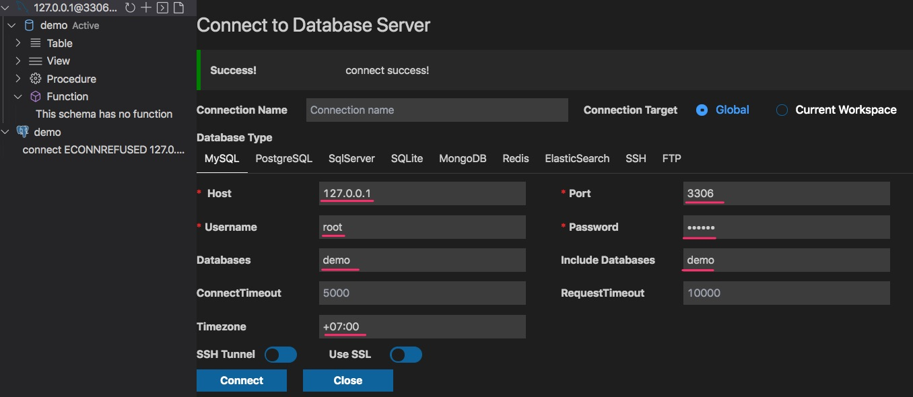
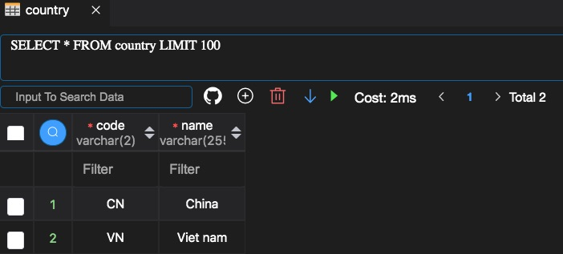

## Lab 1: Cài đặt Docker
Cài đặt Docker Desktop  [https://www.docker.com/products/docker-desktop](https://www.docker.com/products/docker-desktop)

## Lab 2: Tạo MySQL Docker Container
Chạy câu lệnh terminal này.
```
docker run --name mydb -e MYSQL_ROOT_PASSWORD=abc123 -d -p 3306:3306 mysql:latest
```

Giải thích:
* docker run` là lệnh khởi tạo một container từ docker image `mysql:latest`. Trong đó `mysql` là tên của docker image. Còn `:latest` là tên tag đánh dấu phiên bản, biến thể của docker image.
* `--name mydb`: đặt tên container
* `-e MYSQL_ROOT_PASSWORD=abc123`: đặt tham số password của tài khoản root trong mysql
* `-d`: chỉ định container chạy ở chế độ daemon (chế độ chạy background)
* `-p 3306:3306`: mở cổng 3306 từ bên ngoài nối vào cổng 3306 của container bên trong.

### Chú ý về  bảo mật:

Sau khi kết nối vào database sử dụng user root, tạo ra một database có tên tuỳ thích ví dụ: shop, demo, mydb... Các bạn cần tạo ra một user mới. Gán quyền truy cập, thực hiện query, thao tác dữ liệu cho user mới riêng đối với database mới tạo. Từ sau, chỉ kết nối với user mới thôi.

root có quyền tối cao, khi kết nối hay expose root quá nhiều, nguy cơ bị chiếm quyền kiểm soát lên database rất nguy hiểm.

## Lab 3: Kết nối đến CSDL dữ liệu MySQL

Cài đặt Extension





## Lab 4: Kết nối đến MySQL container
```go
package main

import (
	"database/sql"
	"fmt"

	_ "github.com/go-sql-driver/mysql"
)

func main() {
	fmt.Println("Go MySQL Tutorial")
	//userid: demo
	//pass: toiyeuhanoi123-
	//database: demo
	db, err := sql.Open("mysql", "demo:toiyeuhanoi123-@tcp(127.0.0.1:3306)/demo")

	// if there is an error opening the connection, handle it
	if err != nil {
		panic(err.Error())
	}
	defer db.Close()
}
```

## Lab 5: Tạo bảng country
```
Table product {
  id int [pk, increment]
  name varchar [not null]
  description varchar [not null]
  madein varchar(2) [ref: > country.code] //quan hệ nhiều - 1
  price int
  manufacturer int [ref: > manufacturer.id]
}

Table country {
  code varchar(2) [pk, not null]
  name varchar [not null]
}
```

```sql
CREATE TABLE `product` (
  `id` int PRIMARY KEY AUTO_INCREMENT,
  `name` varchar(255) NOT NULL,
  `description` varchar(255) NOT NULL,
  `madein` varchar(2),
  `price` int,
  `manufacturer` int
);

CREATE TABLE `country` (
  `code` varchar(2) PRIMARY KEY NOT NULL,
  `name` varchar(255) NOT NULL
);

ALTER TABLE `product` ADD FOREIGN KEY (`madein`) REFERENCES `country` (`code`);
```

```go
func main() {
	db, err := sql.Open("mysql", "demo:toiyeuhanoi123-@tcp(127.0.0.1:3306)/demo")
	if err != nil {
		panic(err.Error())
	}
	defer db.Close()

	countries := map[string]string{
		"VN": "Viet nam",
		"CN": "China",
		"US": "USA",
		"DE": "Germanny",
		"SG": "Singapore",
		"ES": "Spain",
		"KR": "South Korea",
		"JP": "Japan",
	}

	var insert *sql.Rows
	for country_code, country_name := range countries {
		insert, err = db.Query("INSERT INTO country (code, name) VALUES ('" + country_code + "', '" + country_name + "')")
		if err != nil {
			panic(err.Error())
		}
	}
	defer insert.Close()
}
```

Kết quả



## Lab 5: Bảng Category

```
Table category {
  id int [pk, increment]
  name varchar [not null]
  parent_id int [ref: > category.id] //Quan hệ vòng
}
```

```sql
CREATE TABLE `category` (
  `id` int PRIMARY KEY AUTO_INCREMENT,
  `name` varchar(255) NOT NULL,
  `parent_id` int
);
ALTER TABLE `category` ADD FOREIGN KEY (`parent_id`) REFERENCES `category` (`id`);
```

Lệnh Golang để tạo 2 tầng categories

```go
categories := map[string]([]string){
	"điện thoại, máy tính bảng": []string{"smart phone", "điện thoại phổ thông", "máy tính bảng", "máy đọc sách"},
	"điện tử, điện lạnh": []string{"tivi", "dàn âm thanh", "tủ lạnh - tủ mát", "máy điều hoà", "phụ kiện điện lạnh", "máy giặt", "hút bụi", "lọc không khí", "rủa bát"},
	"máy tính, laptop": []string{"desktop", "server", "laptop", "phụ kiện máy tính"},
	"camera, camcoder": []string{"máy ảnh", "máy ảnh kỹ thuật số", "máy quay phim", "camera giám sá", "camera hành trình", "balo", "ống kính"},
	"đồ bếp":           []string{"lò vi sóng", "máy say sinh tố", "máy đánh trứng", "bếp từ", "bếp hồng ngoại", "bếp ga"},
}

statement, err := db.Prepare("INSERT INTO category (name, parent_id) VALUES (?, ?)")
if err != nil {
	panic(err.Error())
}
defer statement.Close()

for key, subcategories := range categories {
	result, err := statement.Exec(key, nil)
	if err != nil {
		panic(err.Error())
	}

	id, err := result.LastInsertId()

	for _, subcat := range subcategories {
		_, err = statement.Exec(subcat, id)
	}
	if err != nil {
		panic(err.Error())
	}
}
```

