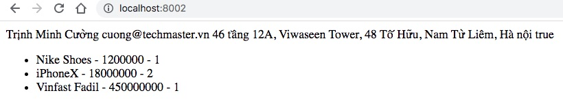

## Cài đặt công cụ thử tải
Cài đặt h2load ở đây https://nghttp2.org/

hoặc cài bằng brew
```
brew install nghttp2
```

Thay đổi giữa HTMLEngine và BlockEngine
```go
func main() {
	app := iris.New() // defaults to these

	template.InitBlockEngine(app, "./views", "")
	//template.InitHTMLEngine(app, "./views", "")

	app.Get("/", hi)

	_ = app.Listen(":8002")
}
```
Giao diện web site ở đây

Rồi biên dịch ứng dụng sau đó chạy file binary
```
go build main.go
./main
```
Chạy benchmark
```
./h2load -n100000 -c300 -m10 --h1 http://localhost:8002
```

## Block
59455.26 req/s
60699.72 req/s
60311.12 req/s
58933.11 req/s
56247.34 req/s

## HTML
39540.38 req/s
39158.33 req/s
39003.52 req/s
39162.36 req/s

## Nhận xét
Block template chạy nhanh hơn HTML template 